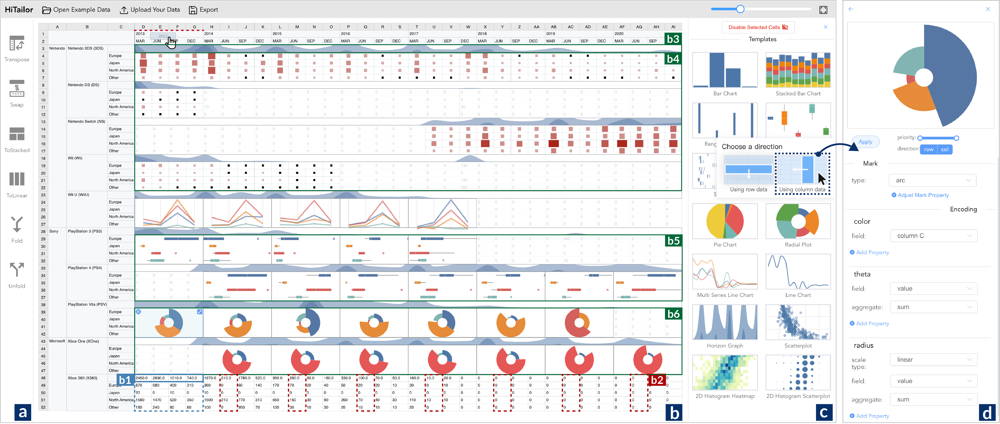
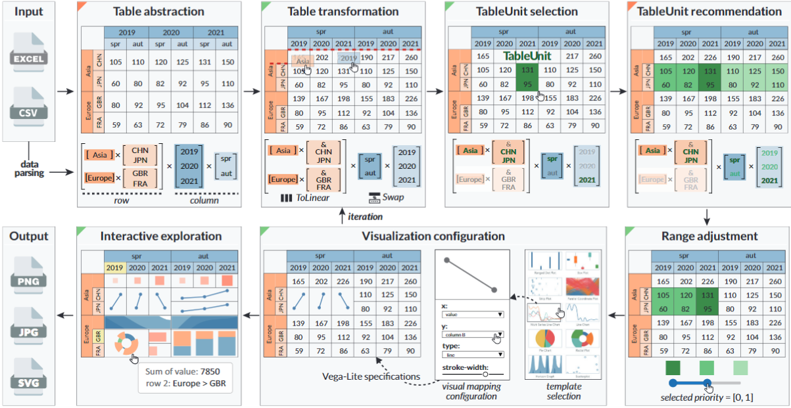

# HiTailor
HiTailor is a technique for presenting and exploring hierarchical tables. HiTailor constructs an abstract model, which defines row/column headings as biclustering and hierarchical structures. Based on the abstract model, we identify three pairs of operators, Swap/Transpose, Fold/Unfold, ToStacked/ToLinear, for transformations of hierarchical tables to support users’ comprehensive explorations. After transformation, users can specify a cell or block of interest in hierarchical tables as a TableUnit for visualization, and HiTailor recommends other related TableUnits according to the abstract model using different mechanisms. We demonstrate the usability of the HiTailor system through a comparative study and a case study with domain experts, showing that HiTailor can present and explore hierarchical tables from different viewpoints. 

This repo contains the code for the HiTailor prototype system, which includes the back-end and the front-end.

## Prototype System

This picture shows the user interface of the Hitailor prototype system. It consists of four panels, including the transformation operator panel, tabular visualization panel, visualization template panel, and visualization configuration panel. These four interactive panels support the process of tabular data analysis.
The prototype system is available at https://hitailor.github.io.

#### Build and Run the Project
To build and run this project on your own, you need to run the back-end and the front-end simultaneously.

- **Back-End**
    1. Go to the back-end folder `cd ./BackEnd`
    2. Install the python dependency
    3. Run the server `python main.py`

- **Front-End**
    1. Change to the front-end folder `cd ./FrontEnd`
    2. Project Setup `npm install`
    3. Compiles and hot-reloads for development `npm run serve`
    4. Compiles and minifies for production `npm run build`

## Technique Details

This picture shows the pipeline of hierarchical table visualization with HiTailor.

The visualization construction starts from the original tabular data. HiTailor constructs an abstract model by parsing the column and row headings of tabular data. Then users can transform the hierarchical tabular data by direct manipulation and select a specific TableUnit. HiTailor recommends other related TableUnits with different priorities. By setting the priority range, users can determine a series of targeted TableUnits. For the visualization of TableUnit, users select a visualization template from the gallery and adjust the visual mapping configurations. The visualization authoring is an iterative process based on the abstract model. Users can interactively explore the hierarchical table from the visualization results and export the results as images. In particular, the procedures with green marks require users’ interaction, and the others with orange marks indicate automatic processes.